>作者:刘早起
>
>公众号: 早起Python
<br><br>

# 前言
在Pandas中每一个DataFrame都有一个Style属性，我们可以通过修改该属性来给数据添加一些基本的样式。
<br><br>

# 使用说明
通过修改Styler对象的属性，将样式传递给DataFrame，主要有两种传递方式

- **Styler.applymap**：对所有的单元格操作样式
- **Styler.apply**：对列/行/表操作样式
<br><br>
Styler.applymap通过DataFrame对所有的单元格操作样式。
<br>
Styler.apply根据axis参数，按列使用axis=0，按行使用axis=1，以及axis=None作用于整个表。所以<br><br>
- 若使用Styler.applymap，我们的函数应返回带有**CSS属性-值对**的单个字符串。
- 若使用Styler.apply，我们的函数应返回具有相同形状的Series或DataFrame，其中每个值都是具有CSS属性值对的字符串。
<br><br>
不会CSS？没关系，作为调包侠的我们大多是改改HTML颜色代码即可完成样式修改，下面看一些示例。
<br><br>

# 一些例子
### 基本样式

首先我们创建一组没有任何样式的数据


```python
import pandas as pd

df = pd.read_csv('test.csv')
df
```

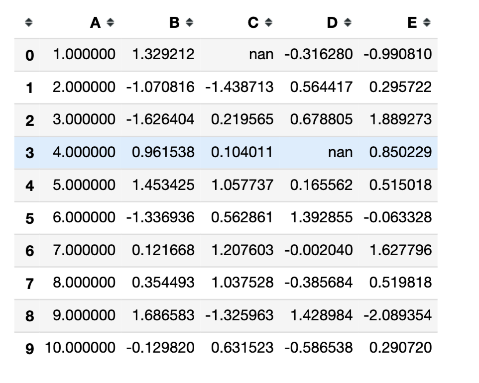


我们之前说过，DataFrame是有style属性的，所以在没有做任何修改的情况下，使用df.style应该和上图一样


```python
df.style
```


现在让我们编写一个简单的样式函数，该函数可以将负数变为红色，使正数保持黑色。


```python
def color_negative_red(val):
    color = 'red' if val< 0 else 'black'
    return 'color: {}'.format(color)
```

现在来应用这段函数


```python
df.style.applymap(color_negative_red)
```

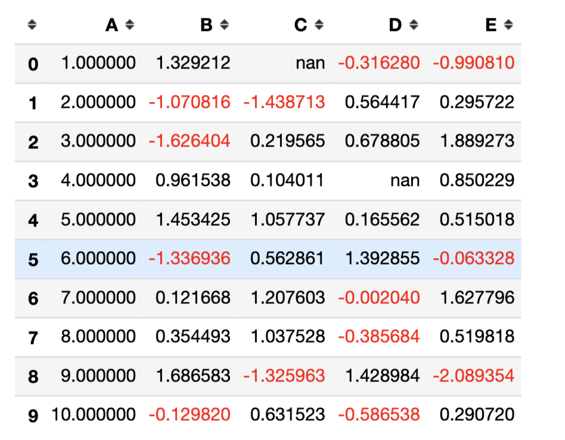


现在如果我们想突出显示**每列**中的最大值，需要重新定义一个函数。


```python
def highlight_max(series):
    is_max = series==series.max()
    return ['background-color: yellow' if v else '' 
            for v in is_max]

#测试一下
highlight_max(df['E'])
```


    ['', '', 'background-color: yellow', '', '', '', '', '', '', '']


之前我们是以单元格为单位进行操作，使用的是.applymap。现在我们待操作的对象是列，所以这里用的是.apply方法


```python
df.style.apply(highlight_max)
```

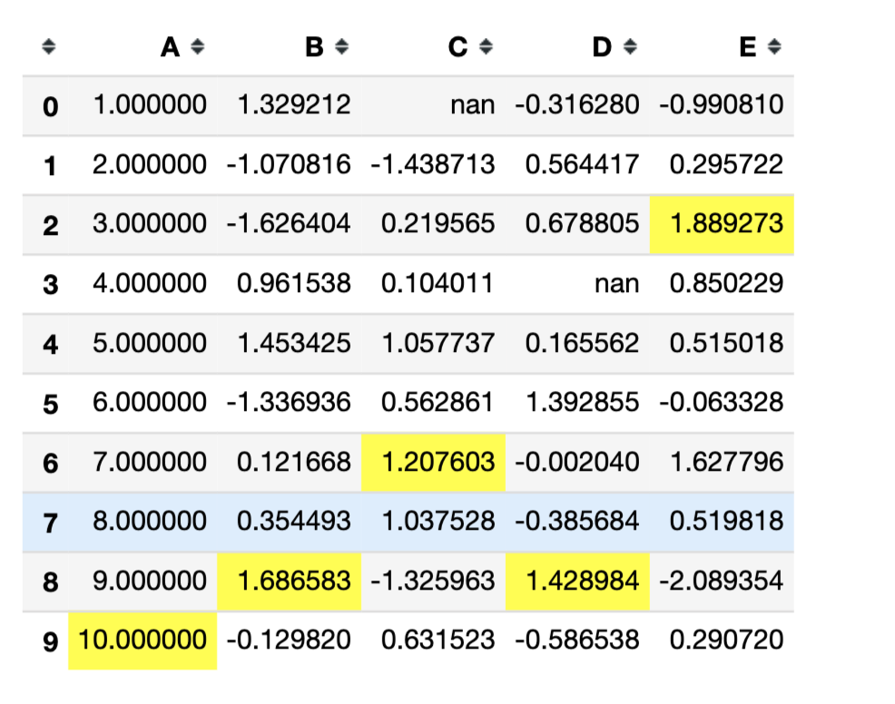


现在可以使用


```python
df.style.applymap(color_negative_red).apply(highlight_max)
```


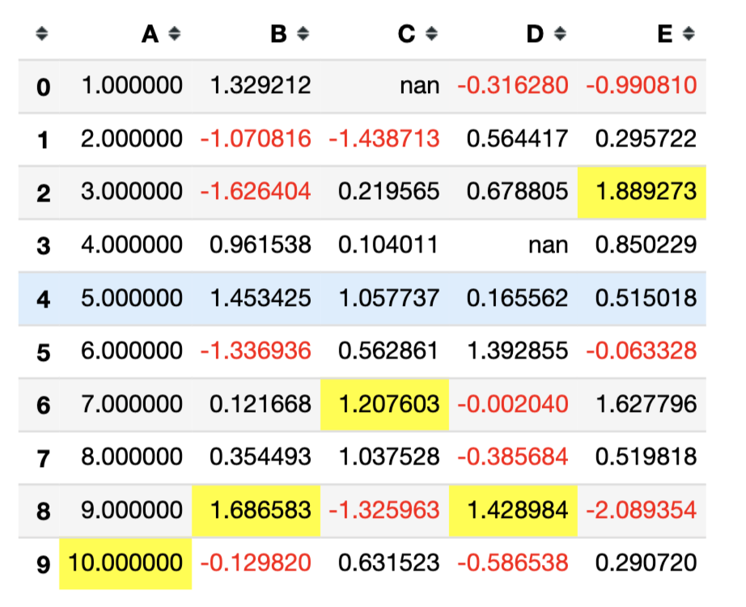


当然我们也可以通过修改样式函数并使用.apply来高亮整个DataFrame的最大值，


```python
import numpy as np

def highlight_max(data, color='yellow'):
    attr = 'background-color: {}'.format(color)
    if data.ndim ==1:
        is_max = data==data.max()
        return [attr if v else '' for v in is_max]
    else:
        is_max = data==data.max().max()
        return pd.DataFrame(np.where(is_max, attr, ''),
                           index=data.index, 
                           columns=data.columns)
    
df.style.apply(highlight_max, 
               color='darkorange', 
               axis=None)
```

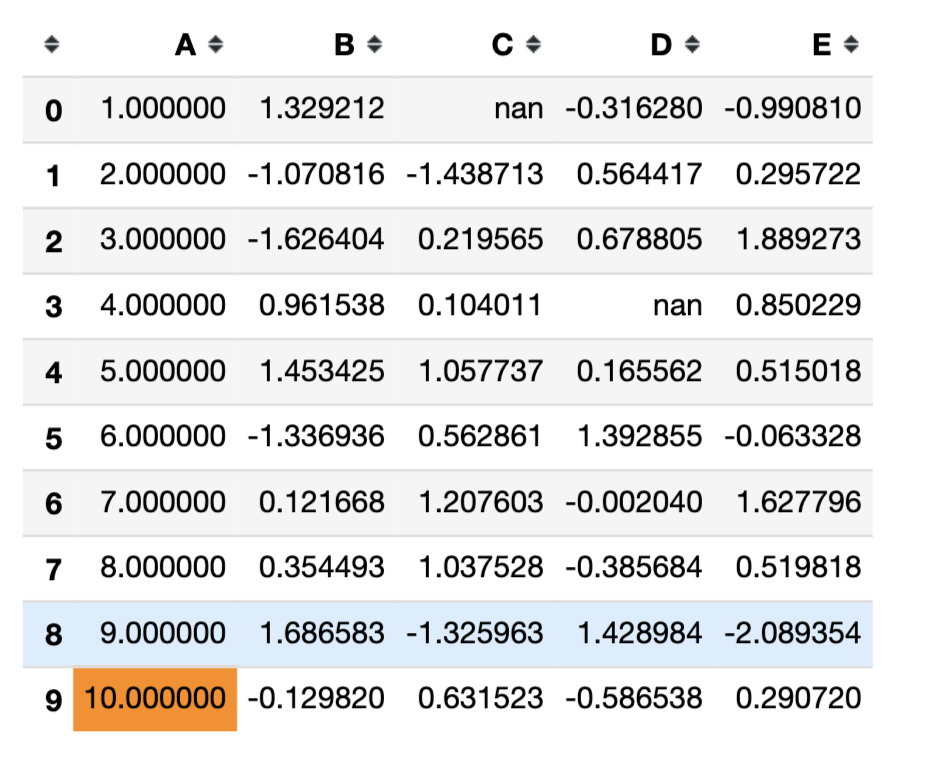


### 选择某列
我们也可以通过**subset**对选中的某列或某几列进行样式修饰


```python
df.style.apply(highlight_max, 
               axis=0, #列方向
               subset=['B', 'C', 'D']) #选择BCD列
```

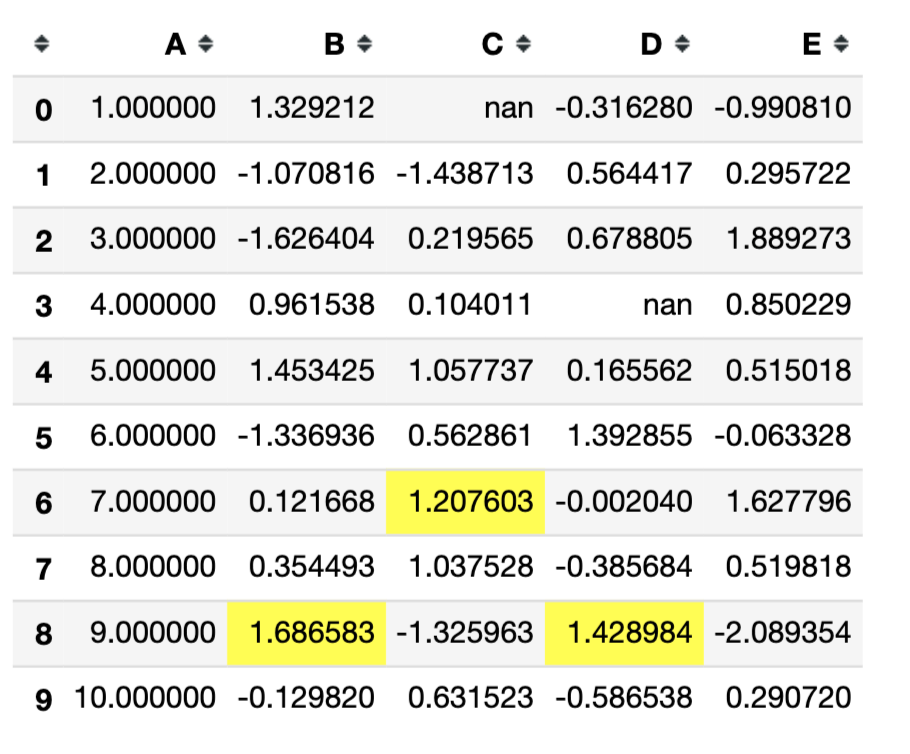


### 格式化输出

我们也可以使用Styler.format来快速格式化输出，比如将小数格式化为百分数


```python
df.style.format("{:.2%}")
```

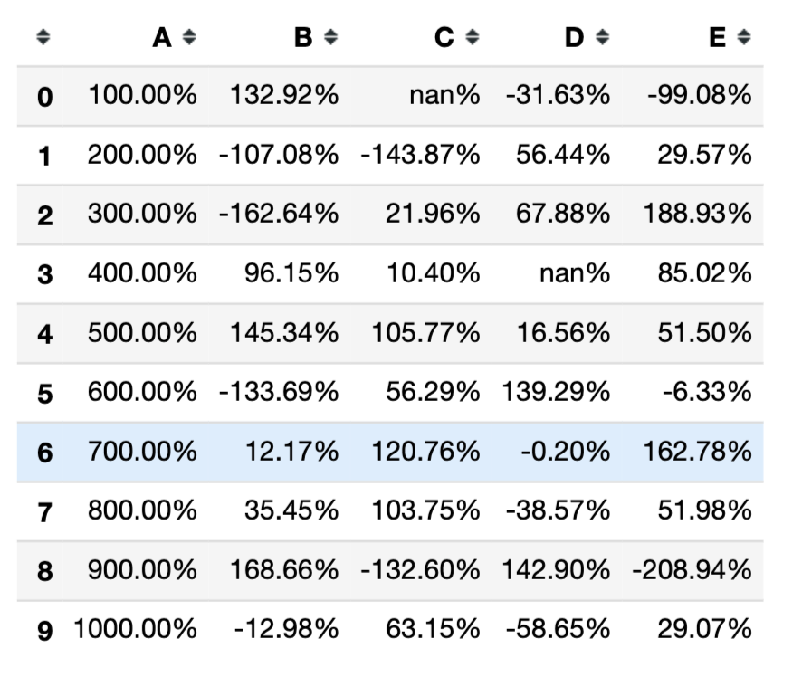


也支持使用字典或lambda表达式来更灵活的使用


```python
df.style.format({'B': "{:.3f}", #保留小数点后3位
                'D': '{:+.3f}'})#带符号，保留小数点后三位
```

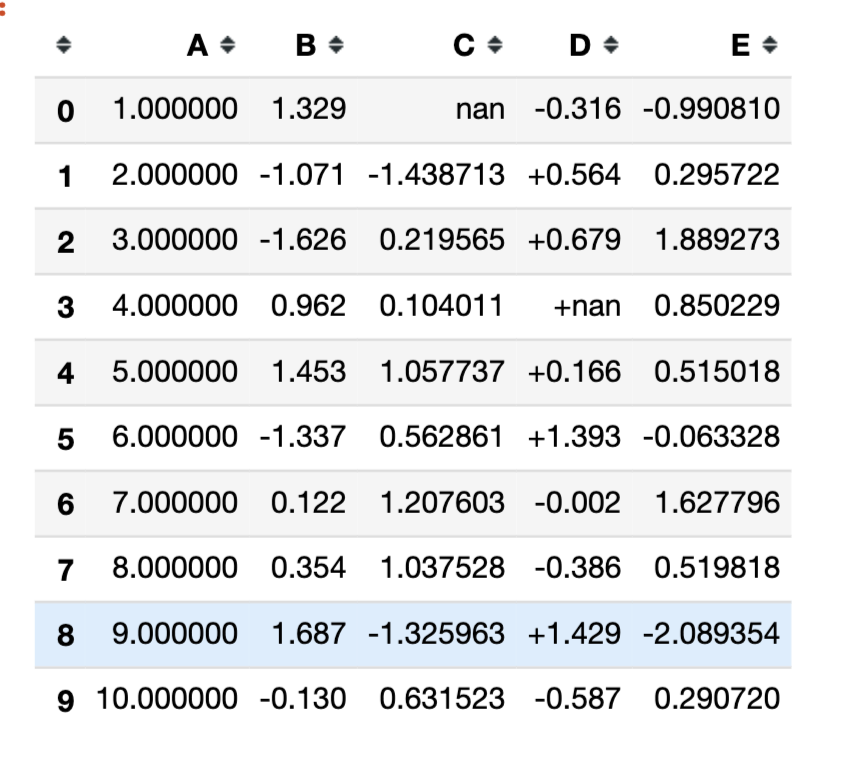


### style内置方法
|方法|功能|
|:---|:---|
|style.format() |格式化|
|style.hide_columns(subset) |隐藏某列|
|style.hide_index()|隐藏行索引|
|style.background_gradient()|梯度下降着色|
|style.bar()|每个数值型单元格显示横向条形图|
|style.highlight_max(color='yellow') |df中每列最大的值着色|
|style.highlight_min(color='yellow')|df中每列最小的值着色|
|style.highlight_null(null_color='red')|df中缺失值着色|
|style.to_excel(xlsxfile) |将dataframe带着样式存到xlsx文件中|


```python
#隐藏A列
df.style.hide_columns('A')
```

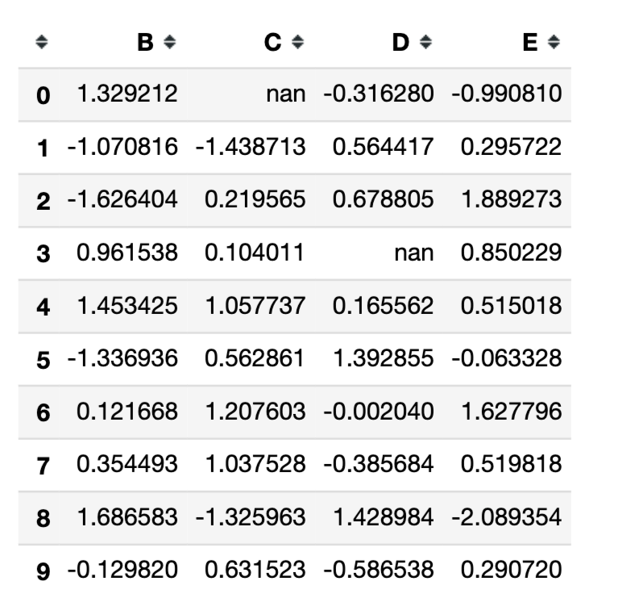


```python
#隐藏行索引
df.style.hide_index()
```

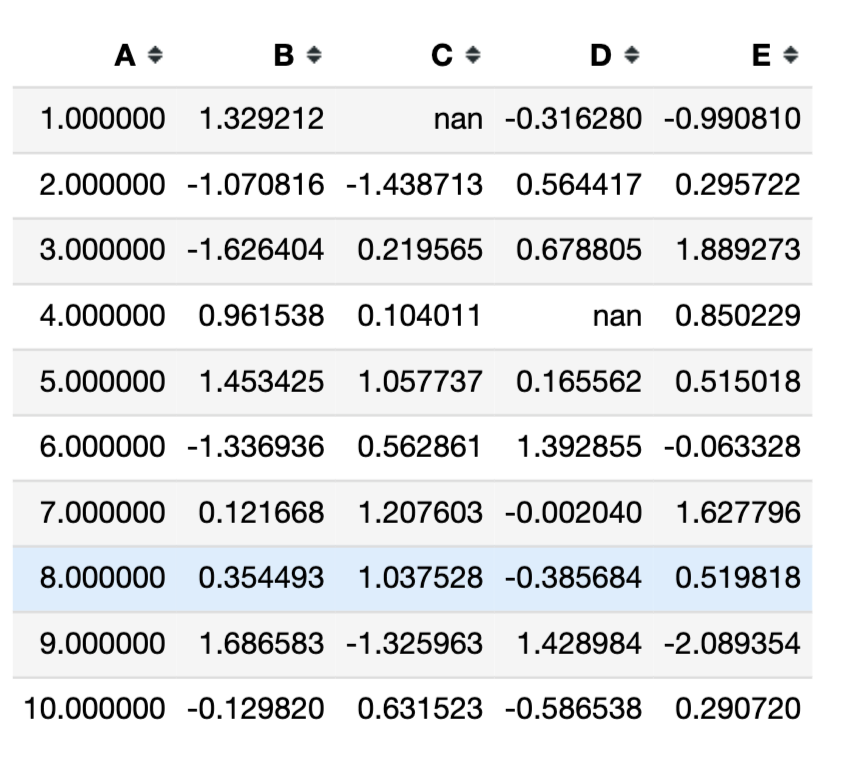


```python
#梯度下降着色
df.style.background_gradient()
```


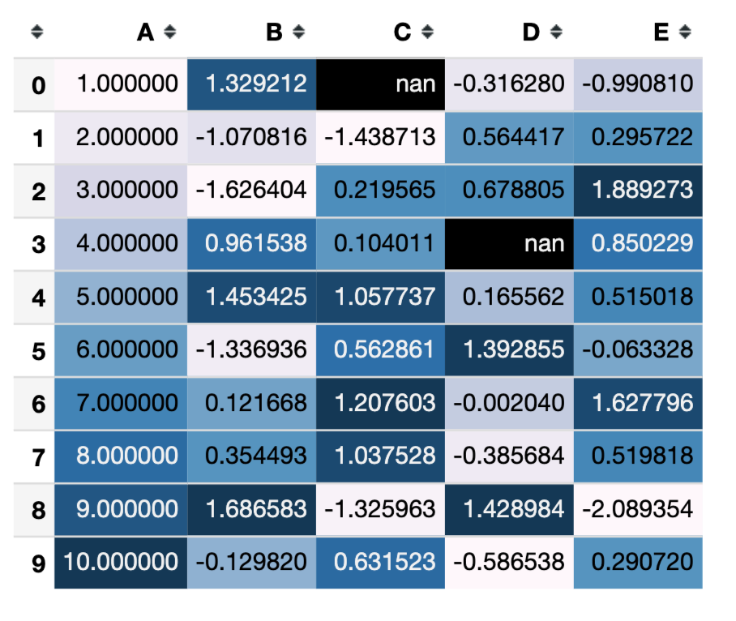


```python
# 最大值着色
#df.style.highlight_max()

#最小值着色
df.style.highlight_min()
```

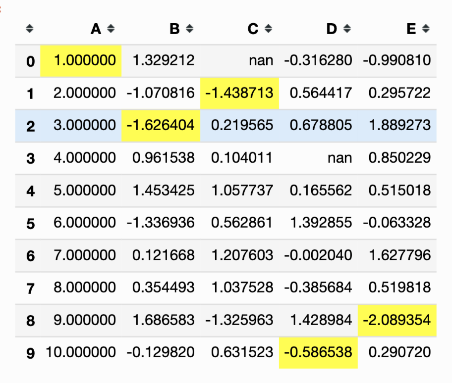


```python
#保存样式到xlsx文件中
new_df = df.style.background_gradient()
new_df.to_excel('test.xlsx')
```

用MS Excel打开test.xlsx文件，

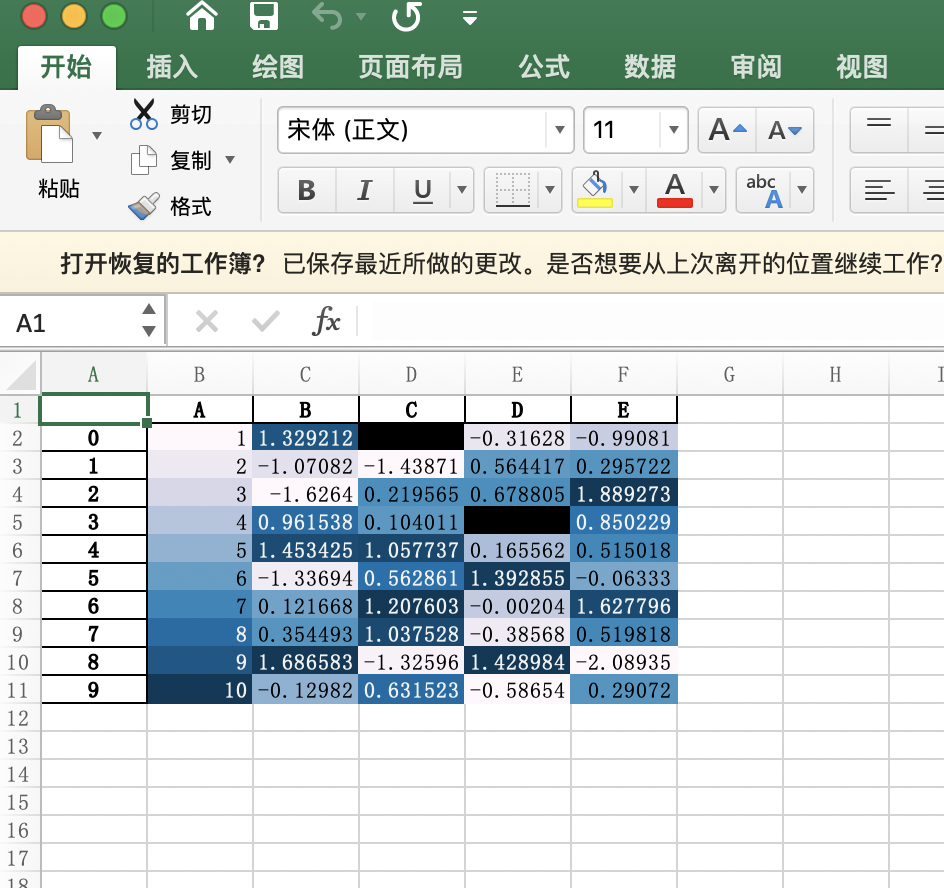

<br>

# 支持一下

