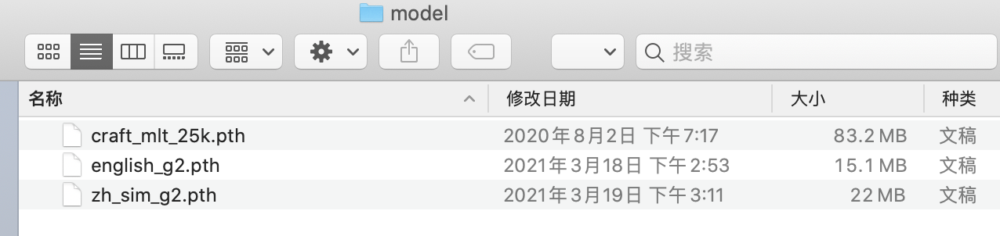

模块easyocr支持70多种语言的即用型OCR，包括中文，日文，韩文和泰文等。

https://github.com/JaidedAI/EasyOCR


## 安装


```python
!pip3 install easyocr==1.4.1
```

## 快速上手
首次使用easyocr识别图片，会自动从网络中下载预训练模型。下载耗时较长，而且大概率遇到URLError错误，推荐下载模型文件，手动放置于指定位置。

```
- Windows:  C:\Users\用户名.EasyOCR\model
- Linux&Mac: ~/.EasyOCR/model
```

easyocr_model.zip链接:https://pan.baidu.com/s/1uZS7SZTDWno0arTLk2G3Bg  密码:wn7q

下载easyocr_model.zip解压, 内部有三个文件。将其复制粘贴于model(上面的路径)中。操作如图



下图是测试图片，含中英文


```python
import easyocr
reader = easyocr.Reader(['ch_sim', 'en'], 
                        gpu=False, 
                        download_enabled=False) # this needs to run only once to load the model into memory

result = reader.readtext('examples/chinese.jpg')
result
```

    Using CPU. Note: This module is much faster with a GPU.


    [([[86, 80], [134, 80], [134, 128], [86, 128]], '西', 0.6629583033293649),
     ([[189, 75], [469, 75], [469, 165], [189, 165]], '愚园路', 0.9623039316627005),
     ([[517, 81], [565, 81], [565, 123], [517, 123]], '东', 0.9932548686089291),
     ([[78, 126], [136, 126], [136, 156], [78, 156]], '315', 0.999992910975279),
     ([[514, 126], [574, 126], [574, 156], [514, 156]], '309', 0.9999620084121807),
     ([[79, 173], [125, 173], [125, 213], [79, 213]], 'W', 0.2336996358372403),
     ([[226, 170], [414, 170], [414, 220], [226, 220]],
      'Yuyuan Rd。',
      0.8949630587435853),
     ([[529, 173], [569, 173], [569, 213], [529, 213]], 'E', 0.5179032005942332)]


## 注意
- Note-1: ``['ch_sim','en']`` 是需要导入的语言识别模型，可以传入多个语言模型，其中英语模型en可以与其他语言共同使用。
- Note-2: 图片可以传入图片路径、也可以传入图片链接。但推荐传入图片路径，会提高识别速度。
- Note-3: 代码``reader = easyocr.Reader(['ch_sim','en'])``首次运行耗时特别久，时间主要消耗在下载与导入。后续调用reader时就不会这么慢了。
- Note-4: 设置detail=0可以简化输出结果


```python
result2 = reader.readtext('examples/chinese.jpg', detail=0)
result2
```


    ['西', '愚园路', '东', '315', '309', 'W', 'Yuyuan Rd。', 'E']


